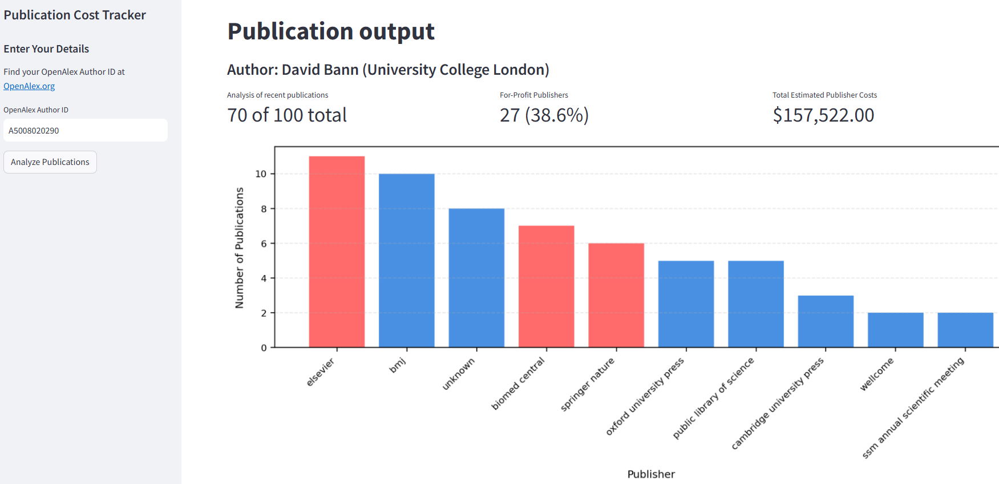

# Publication Cost Tracker
A simple tool that estimates the cost of publishing - including the % of for profit publishers - for academic authors.

- **View the live demo**: [HERE](https://pubanalyser.streamlit.app/) 
- **How it works**: Enter author name (or ORCID or OpenAlex Author ID), and the app retrieves their publications, categorizes the publishers, and estimates total costs.

**Screenshot**:

