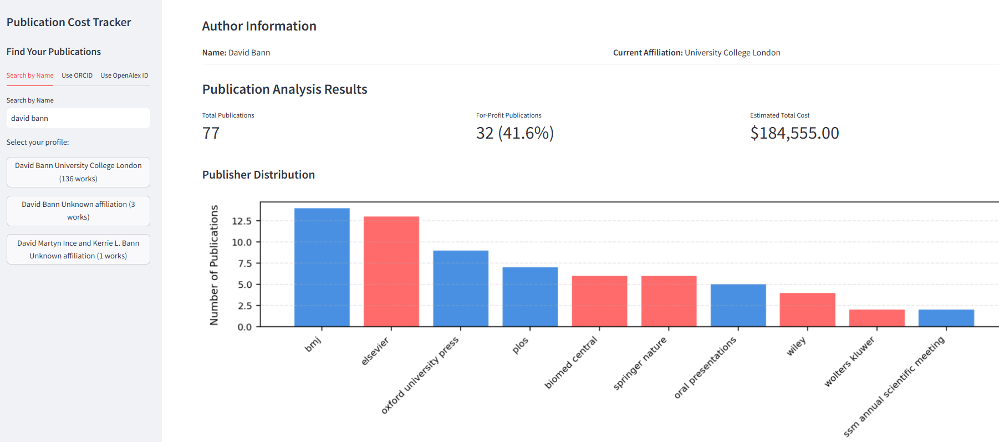

# Publication Cost Tracker
A simple tool that estimates the cost of publishing - including the % of for profit publishers - for academic authors.

- **View the live demo**: [HERE](https://pubanalyser.streamlit.app/)
- **How it works**: Enter author name (or ORCID or OpenAlex Author ID), and the app retrieves their publications, categorizes the publishers, and estimates total costs.

**Screenshot**:



# Running locally
To run the tool on your own machine, perform the following steps:
## Step 1: Clone / download this repo to a folder on your machine.
- using the githib cli: `gh repo clone dbann/grantreview`
- using git: `git clone https://github.com/dbann/grantreview`
- manually: navigate to the [repo on github.com](https://github.com/dbann/grantreview), click on the green `<> Code` button, and press `Download ZIP`. Extract to a new folder on your machine.
## Step 2: Install python & the required dependencies (found in requirements.txt).
We recommend [uv](https://docs.astral.sh/uv/) to install, manage & run python. If you haven't installed uv yet, you can do so with a single line of code:

**Windows**: open `PowerShell` and run this command:
```pwsh
powershell -ExecutionPolicy ByPass -c "irm https://astral.sh/uv/install.ps1 | iex"
```
**MacOS/Linux**: open a bash-compliant terminal and run:
```bash
curl -LsSf https://astral.sh/uv/install.sh | sh
```
you can also use `wget` instead of `curl` if necessary:
```bash
wget -qO- https://astral.sh/uv/install.sh | sh
```

### Running the app with uv
0. Open the terminal of your choice (the one you installed `uv` for)
1. Navigate to the dir with the repo, e.g. `cd c:\dev\pubanalyser\`
2. Initialize the environment with the command `uv sync`. This will automatically do a local install of python with all dependencies required.
3. Run the app with the command: `uv run streamlit run pubanalyser.py`. This should open the app in your browser.

### Without uv
If don't want to use uv: set up Python yourself, make sure to install the dependencies as listed in `requirements.txt` or `pyproject.toml`, and then run the app using `python -m streamlit run pubanalyser.py`.

# Contact/give feedback
This is a proof of concept prototype. Feedback (david.bann@ucl.ac.uk) is welcome.
